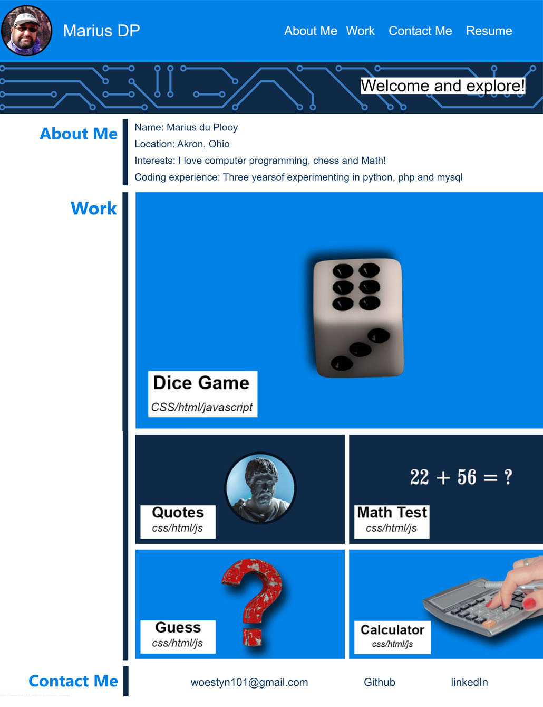

# OSU Bootcamp challenge 2

## Description

This challenge helped me to practice advance CSS concepts and to make a website web-responsive

During this project I learned:

- flex-box.
- css-grid layout
- Web-sponsiveness.
- Use of a css-reset page.

## Link to website

(https://woestyn101.github.io/myprofile/)

## Installation (N/A)

## Usage

## Screenshot of website

## Credits (N/A)

## License

MIT
